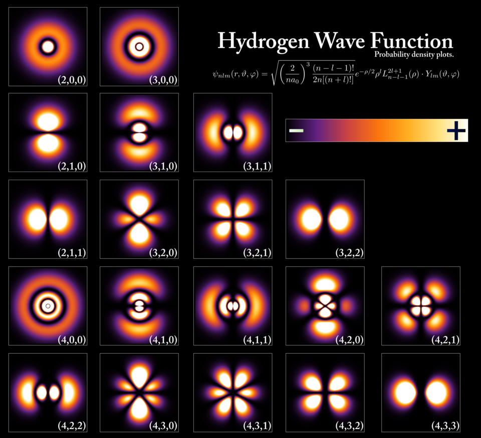

# Hydrogen Atom Orbital Simulator

Visualize analytical hydrogen wavefunctions and probability densities on a
two-dimensional slice through the atom. The project combines a reusable Python
script with a Jupyter notebook that develops the underlying radial and angular
solutions.



## What it computes

The stationary hydrogen wavefunction separates as

$$
\psi_{n\ell m}(r,\theta,\phi)
=R_{n\ell}(r)Y_\ell^m(\theta,\phi),
$$

and the probability density is $|\psi_{n\ell m}|^2$. The implementation uses
associated Laguerre polynomials for the normalized radial solution and SciPy's
spherical harmonics for the angular solution. Distances use atomic units, so
$a_0=1$.

Valid quantum numbers satisfy:

- $n \ge 1$
- $0 \le \ell < n$
- $-\ell \le m \le \ell$

## Repository layout

```text
orbital_simulator.py  Command-line simulator and plotting functions
derivations.ipynb     Step-by-step mathematical derivation and exploration
assets/               Images used by this README
outputs/              Example generated figures
requirements.txt      Runtime dependencies
```

The former `main.py` and `main2.py` scratch files were consolidated into
`orbital_simulator.py` so there is one documented implementation.

## Setup

```bash
python -m venv .venv
```

Activate the environment:

```powershell
.\.venv\Scripts\Activate.ps1
```

```bash
python -m pip install --upgrade pip
python -m pip install -r requirements.txt
```

## Usage

Display the default $2p_z$ state:

```bash
python orbital_simulator.py
```

Choose a state and save the plot:

```bash
python orbital_simulator.py --n 3 --l 2 --m 0 --output outputs/orbital_320.png
```

Useful options:

```text
--n, --l, --m       Quantum numbers
--extent            Half-width of the x-z slice in Bohr radii
--resolution        Number of samples along each axis
--output            Image path; omit to open an interactive window
```

To follow the derivation interactively:

```bash
python -m pip install jupyter
jupyter notebook derivations.ipynb
```

## Numerical scope

- The wavefunctions are analytical; numerical discretization is used only to
  sample and display them.
- The current visualization is an x-z plane with $y=0$, not a full 3D orbital.
- Brightness in the density panel represents probability density, not a
  classical electron trajectory.

## License and contact

The repository is distributed under CC BY 4.0; see [LICENSE](LICENSE).

Maintainer: Shaurya Attreya — shauryaattreya@gmail.com
